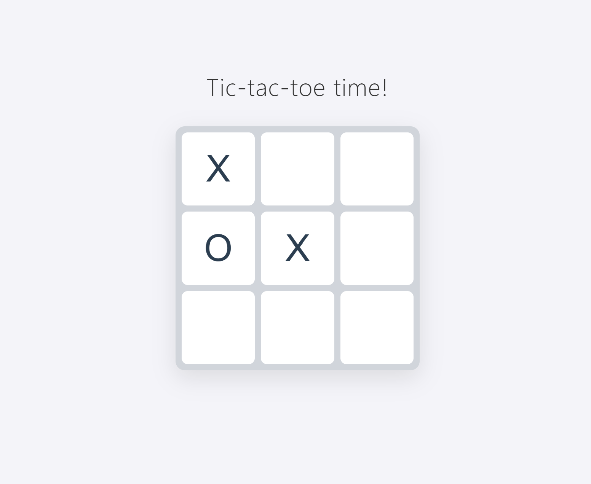

# Tic-Tac-Toe

A sophisticated implementation of the classic Tic-Tac-Toe game, designed with a focus on Object-Oriented Programming (OOP) principles. 

[The live game is here!](https://hnstz.github.io/Tic-Tac-Toe/)

## Tech Stack
* **Language:** Vanilla JavaScript (ES6+)
* **Markup:** Semantic HTML5
* **Styling:** CSS3 (Grid, Flexbox, Transitions)
* **Architecture:** Factory Functions & Module Pattern

---

## Getting Started

1.  **Clone the repository:**
    ```bash
    git clone https://github.com/hnstz/Tic-Tac-Toe.git
    ```
2.  **Navigate to the folder:**
    ```bash
    cd Tic-Tac-Toe
    ```
3.  **Run the project:**
    Open `index.html` using **Live Server** (VS Code extension) or any local web server.

---
